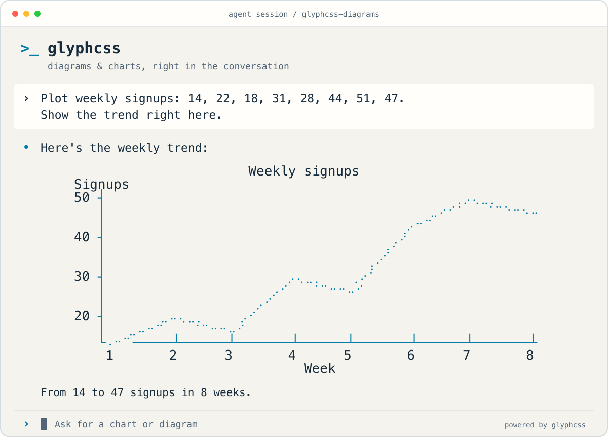
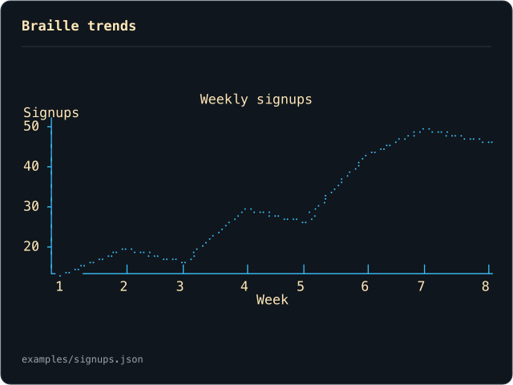
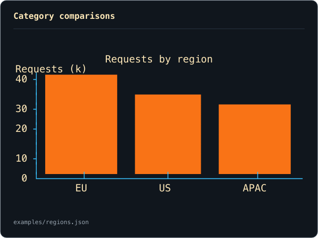
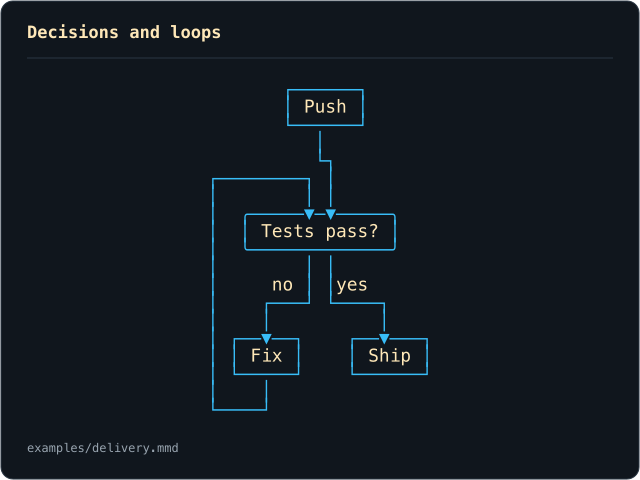
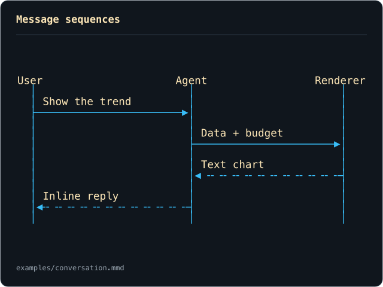
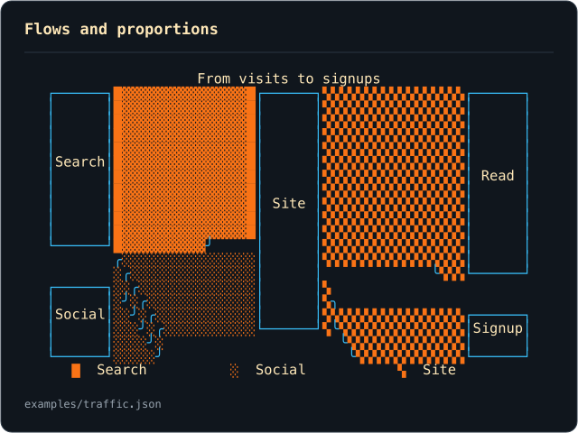
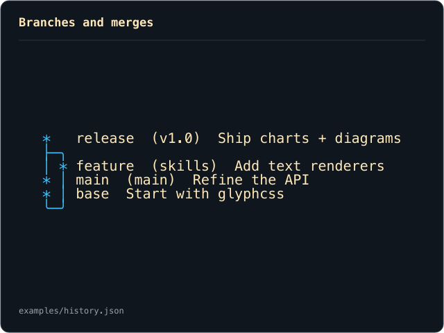

<h1>
  <picture>
    <source media="(prefers-color-scheme: dark)" srcset="assets/hero-dark.png">
    
  </picture>
</h1>

<p align="center">
  <strong>Two agent skills for charts and diagrams, directly in chat or your terminal.</strong><br>
  <a href="#install">Install</a> · <a href="#what-it-renders">Gallery</a> · <a href="#just-ask">Example prompts</a> · <a href="docs/installation.md">All providers</a> · <a href="LICENSE">MIT license</a>
</p>

**Powered by [apresmoi/glyphcss](https://github.com/apresmoi/glyphcss)** — the text rendering library behind [`@glyphcss/charts`](https://github.com/apresmoi/glyphcss/tree/main/packages/charts) and [`@glyphcss/diagrams`](https://github.com/apresmoi/glyphcss/tree/main/packages/diagrams).

Describe a workflow, paste Mermaid, or hand your agent some data. It chooses a layout, runs the renderer, and puts the resulting text in its reply. Trend lines use braille; diagrams use box characters. The same output works in a terminal, a code review, or a conversation.

**Node.js 22+** · **Claude Code + Codex plugins** · **Portable Agent Skills** · **MIT**

## What it renders

<table>
<tr>
<td width="50%">
<a href="assets/trend.svg"></a><br>
<strong>Trends</strong> — lines and areas, with braille detail.<br>
<a href="examples/signups.json">Source</a> · <a href="examples/trend.txt">Plain text</a>
</td>
<td width="50%">
<a href="assets/bars.svg"></a><br>
<strong>Comparisons</strong> — categories, values, and units.<br>
<a href="examples/regions.json">Source</a> · <a href="examples/bars.txt">Plain text</a>
</td>
</tr>
<tr>
<td>
<a href="assets/workflow.svg"></a><br>
<strong>Workflows</strong> — decisions, dependencies, and loops.<br>
<a href="examples/delivery.mmd">Source</a> · <a href="examples/workflow.txt">Plain text</a>
</td>
<td>
<a href="assets/sequence.svg"></a><br>
<strong>Sequences</strong> — who says what, and when.<br>
<a href="examples/conversation.mmd">Source</a> · <a href="examples/sequence.txt">Plain text</a>
</td>
</tr>
<tr>
<td>
<a href="assets/flows.svg"></a><br>
<strong>Flows</strong> — Sankey paths, proportions, and funnels.<br>
<a href="examples/traffic.json">Source</a> · <a href="examples/flows.txt">Plain text</a>
</td>
<td>
<a href="assets/history.svg"></a><br>
<strong>Histories</strong> — branches, merges, and parallel work.<br>
<a href="examples/history.json">Source</a> · <a href="examples/history.txt">Plain text</a>
</td>
</tr>
</table>

Every preview is generated from its linked source by the bundled renderer. Gallery colors style the documentation; chat output is monochrome. The examples use illustrative data.

| Skill | Authoring surface | Also supports |
|---|---|---|
| [glyphcss-charts](skills/glyphcss-charts/SKILL.md) | JSON data and marks | Scatter plots, heatmaps, arcs, multiple series, transforms, scales, axes |
| [glyphcss-diagrams](skills/glyphcss-diagrams/SKILL.md) | Mermaid, graph JSON, sequence JSON, Git log | Node shapes, groups, labeled edges, sequence frames, lane histories |

## Install

Choose one route for each agent. Each route installs the same two skills, including their self-contained renderers. **Rendering needs Node.js 22+; it needs no package installation or API key.** Start a new agent session after installing.

### Claude Code

```sh
claude plugin marketplace add apresmoi/glyphcss-diagrams
claude plugin install glyphcss-diagrams@glyphcss-diagrams
```

Inside Claude Code, the equivalents are `/plugin marketplace add` and `/plugin install`. Both skills are included in the plugin.

### Codex

```sh
codex plugin marketplace add apresmoi/glyphcss-diagrams
codex plugin add glyphcss-diagrams@glyphcss-diagrams
```

For clients without the plugin CLI, use the standalone installer below.

### Standalone skills and editable installs

Clone once, then link both skills to the providers you use. These commands install for Claude Code and Codex:

```sh
test -d glyphcss-diagrams/.git || git clone https://github.com/apresmoi/glyphcss-diagrams.git
cd glyphcss-diagrams
node install.mjs --provider claude
node install.mjs --provider codex
```

The installer is dependency-free and safe to rerun. It preserves unrelated installations. Use `--copy` for independent copies, or `--dest /path/to/skills` for a custom host. [Provider paths, updates, and removal](docs/installation.md#grok-antigravity-cursor-opencode-and-editable-installs).

For the cross-agent installer:

```sh
npx skills add apresmoi/glyphcss-diagrams --global --skill glyphcss-charts --skill glyphcss-diagrams
```

### More providers

| Provider | Setup |
|---|---|
| GitHub Copilot CLI | [Native marketplace plugin](docs/installation.md#github-copilot-cli) |
| Factory Droid | [Native marketplace plugin](docs/installation.md#factory-droid) |
| Pi | [Git package with both skills](docs/installation.md#pi) |
| Grok | [Standalone installer](docs/installation.md#grok-antigravity-cursor-opencode-and-editable-installs) |
| Antigravity CLI / IDE | [Separate provider targets](docs/installation.md#grok-antigravity-cursor-opencode-and-editable-installs) |
| Cursor / OpenCode | [Standalone installer](docs/installation.md#grok-antigravity-cursor-opencode-and-editable-installs) |
| Kiro | [Import the two skill folders](docs/installation.md#kiro) |
| Other Agent Skills hosts | [Cross-agent installer or a custom skills directory](docs/installation.md#other-agent-skills-hosts) |

## Just ask

> Plot weekly signups: 14, 22, 18, 31, 28, 44, 51, 47. Show the trend directly in chat.

> Draw our delivery workflow: push, run tests, ship if they pass, otherwise fix and retry.

> Turn this Mermaid sequence into a text diagram in your reply.

> Compare these regions with a bar chart. Keep the original values and units.

You can name `glyphcss-charts` or `glyphcss-diagrams` explicitly. In Claude's plugin, the skill commands are `/glyphcss-diagrams:glyphcss-charts` and `/glyphcss-diagrams:glyphcss-diagrams`.

## How it fits

| Destination | Layout budget |
|---|---|
| Chat | 72 columns × 24 rows per panel by default; uses a supplied host budget when available |
| Direct terminal output | Reads stdout's actual TTY dimensions, with a small margin; otherwise 80 × 24 |
| Explicit size | `--width N --height N` in character cells |

Diagrams wrap labels, adjust spacing, try the other orientation, and paginate as needed. The renderer checks dimensions and graph coverage. Charts reject data loss; the agent can split crowded data into complete smaller charts. The skills never ask you to measure your window or mistake a tool subprocess's TTY for the chat viewport.

Line and area charts select the braille charset by default. Other chat charts and diagrams select box characters. `--charset ascii` provides a strict ASCII option. Actual renderer output goes into the reply; file exports are optional when requested.

## Built on Glyphcss

This repository owns the **skills, provider packaging, installers, and bundled command-line renderers**. The rendering algorithms and library APIs live in **[apresmoi/glyphcss](https://github.com/apresmoi/glyphcss)**.

- [Chart library and API](https://github.com/apresmoi/glyphcss/tree/main/packages/charts) — marks, data, scales, axes, and text rendering.
- [Diagram library and API](https://github.com/apresmoi/glyphcss/tree/main/packages/diagrams) — graph layout, Mermaid, sequences, and lanes.
- [Chart authoring reference](skills/glyphcss-charts/references/spec.md) · [Diagram authoring reference](skills/glyphcss-diagrams/references/source.md).

The committed bundles let an installed skill run independently of either checkout. Rebuilding them requires an explicit library source path.

<details>
<summary><strong>Development: build, test, and regenerate the gallery</strong></summary>

Node.js 22+ and pnpm are required for development. From a directory that will hold both checkouts:

```sh
test -d glyphcss-source/.git || git clone https://github.com/apresmoi/glyphcss.git glyphcss-source
test -d glyphcss-diagrams/.git || git clone https://github.com/apresmoi/glyphcss-diagrams.git
pnpm --dir glyphcss-source install --frozen-lockfile
cd glyphcss-diagrams
npm ci
npm run build -- --source ../glyphcss-source
npm test
npm run gallery
```

For a checkout nested inside the library repository, pass `--source ..`. `npm test` checks the committed bundles, packaging, and installer behavior without development dependencies. `npm run gallery` renders the six example sources into plain text, SVG, and PNG; the graphics are reproducible outputs of the libraries.

</details>

## License

[MIT](LICENSE). The renderer code comes from [Glyphcss](https://github.com/apresmoi/glyphcss), also MIT. Bundled third-party notices ship with each skill: [charts](skills/glyphcss-charts/scripts/NOTICE.txt) and [diagrams](skills/glyphcss-diagrams/scripts/NOTICE.txt).
